# DRONE_Ardupilot-APM-
DIY for Drone 

## Requirements :

Frame:
 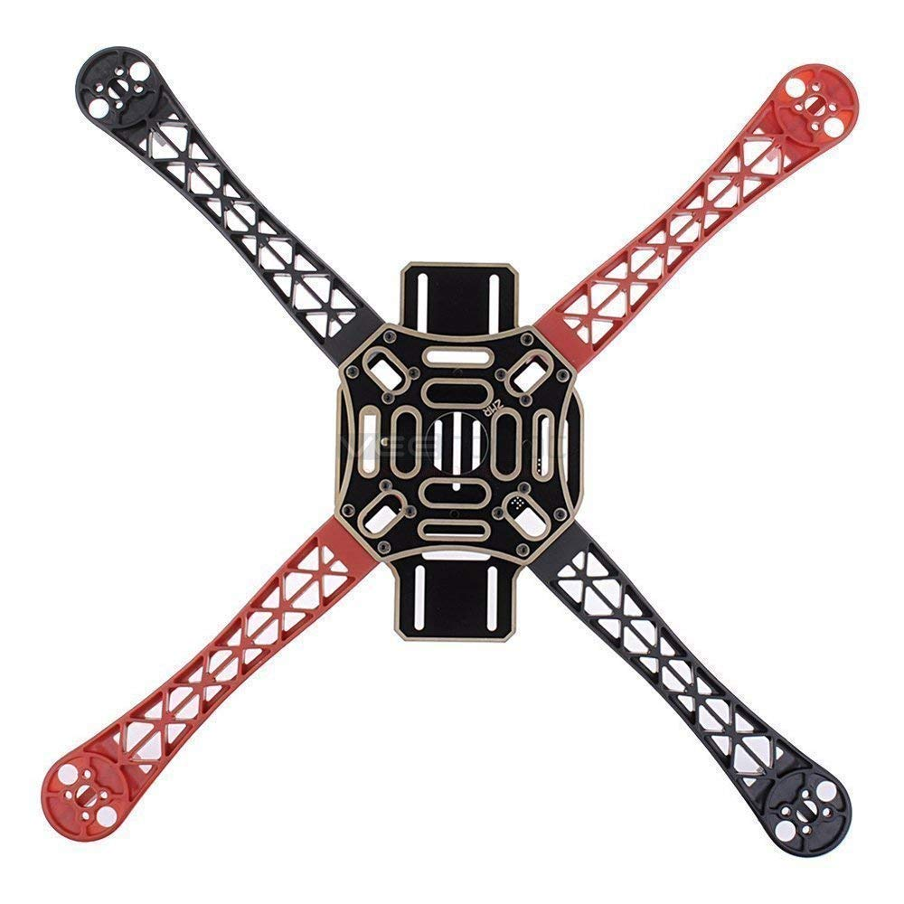

* F450 

Flight Controller (FC):

  

* Ardupilot/Arducopter(Clone of APM) 

RC Transmitter and Receiver:

  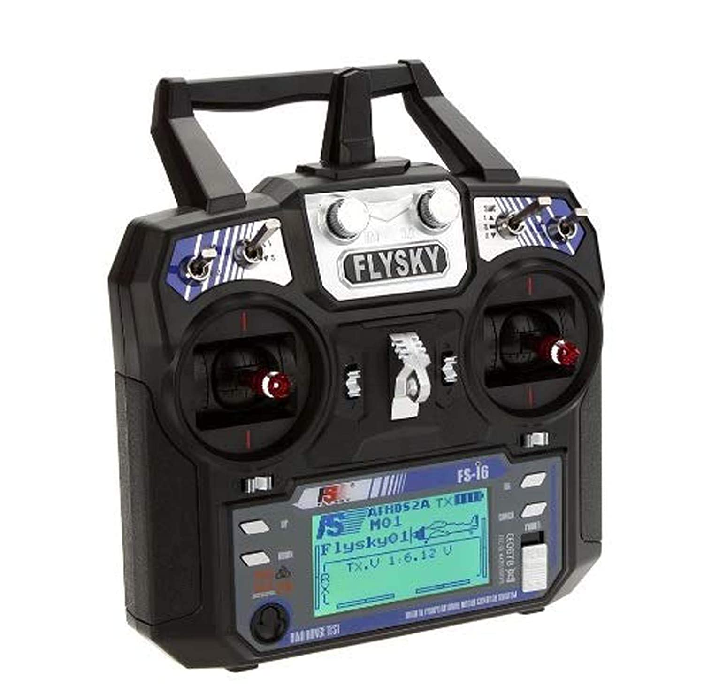

* FlySky FS-i6 2.4G 6CH PPM  With FS-iA6B Receiver

ESCs :

  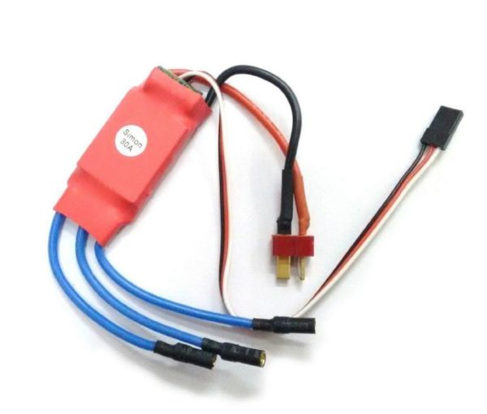

* Four ESCs of 30 Amp ( SimonK)

Motors :
  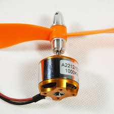
* Four 1000kv motors 
Propellers:
 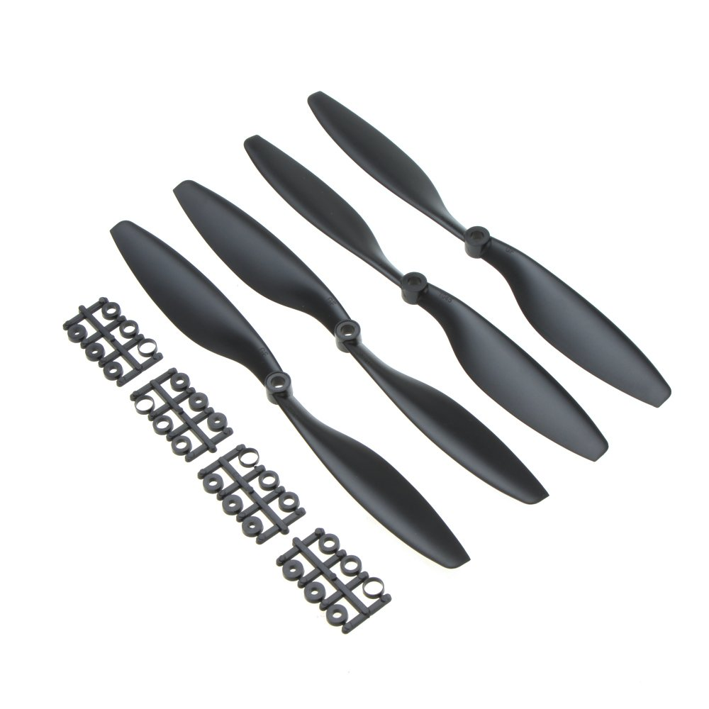
 
* 10X4.5 Inch 1045 / R CW CCW Propeller
Battery :

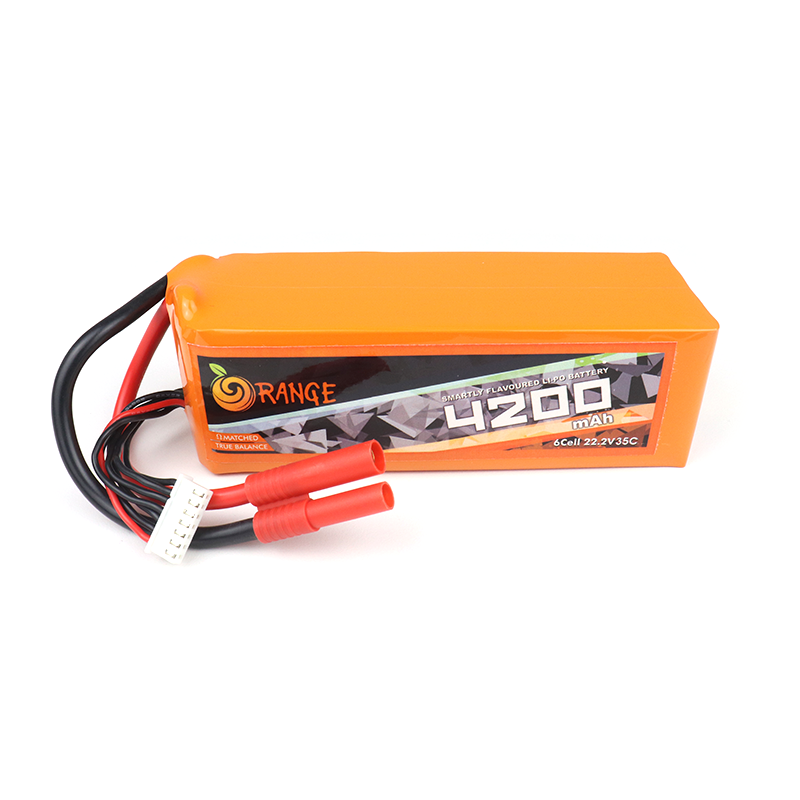

* range from 2500mah - 5000mah Lithium ion / LiPo (3s,4s,6s andy type )

Connectors :

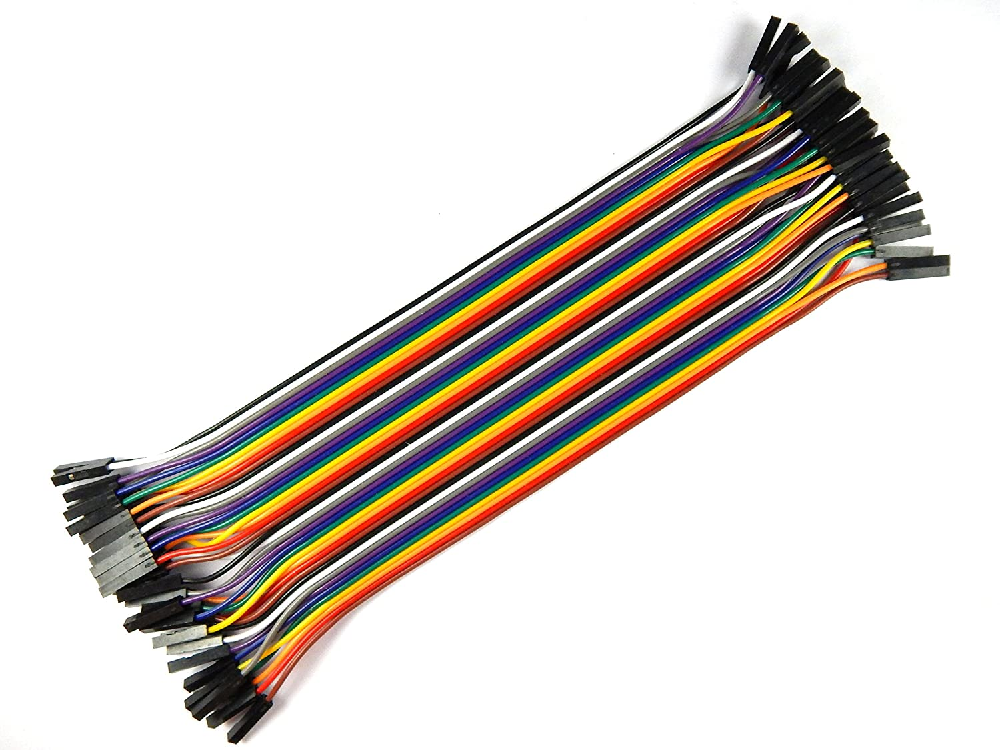

* Jumper cable ( set of 60)

* Zip Ties

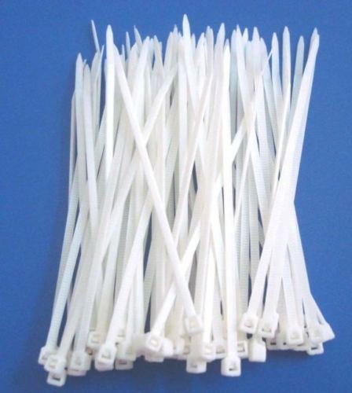

**optional**

Gps module :

  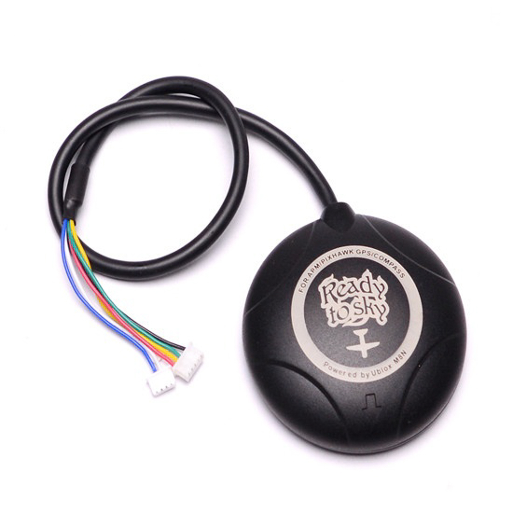

* Ublox GPS M8N

# First assemble the thr drone:
* solder the escs and the battery socket with the frame in the same way. remember f450 frame comes with onboard power distribution system ) see the below image for solder refferance.

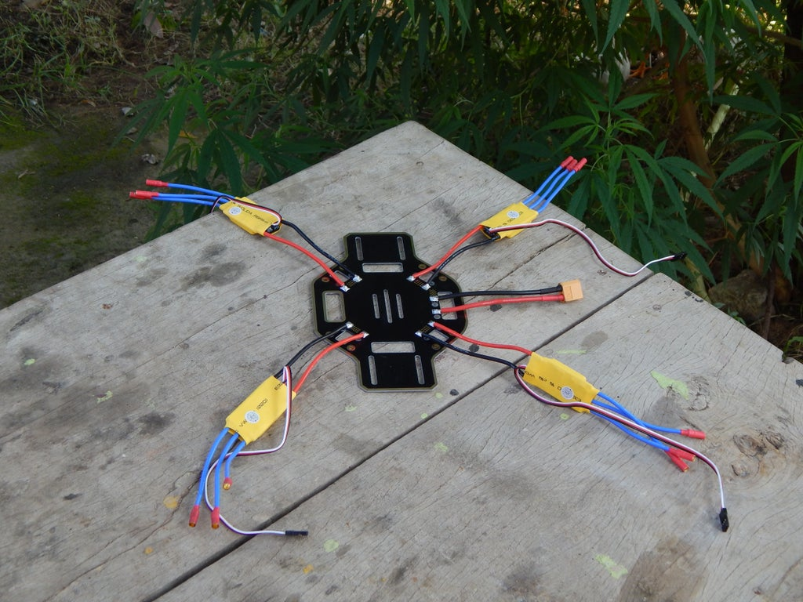

Now screw all the arms of frame (f450) the final frame will look like this :

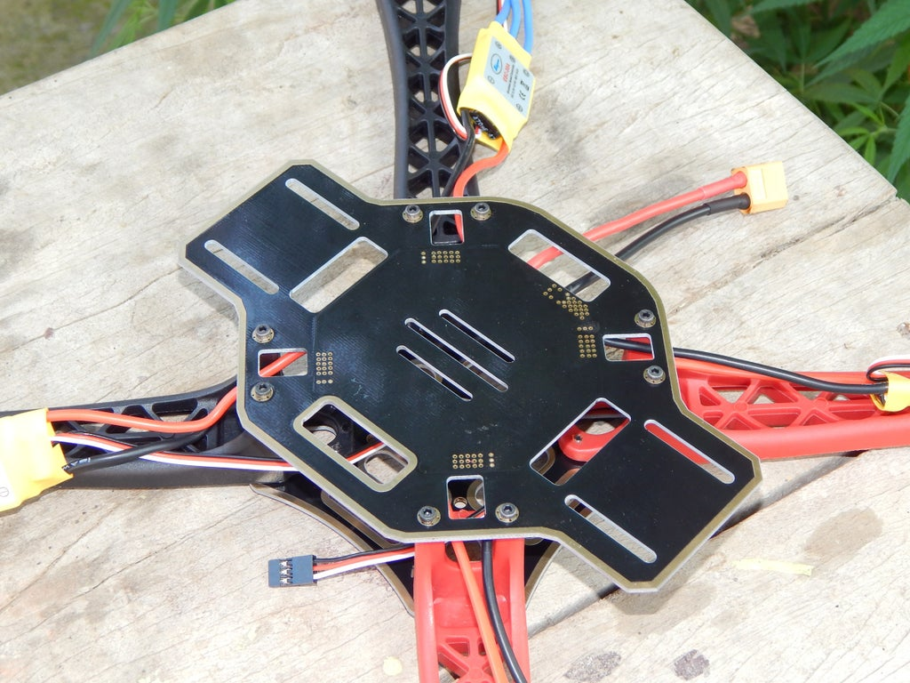

after that use L key to screw the motors on the arms , tie the escs to the arm using zip ties and the recivers on of the arm:

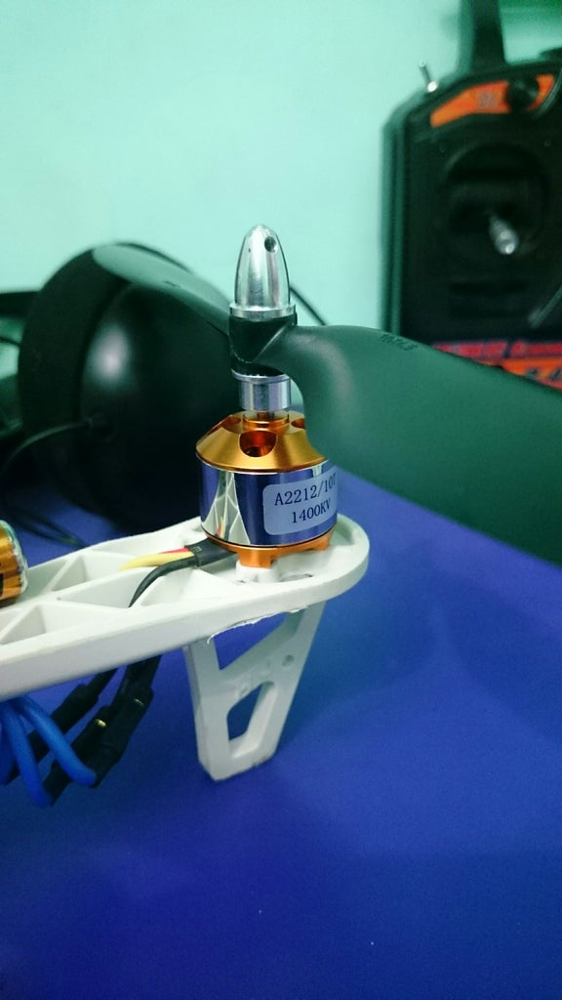 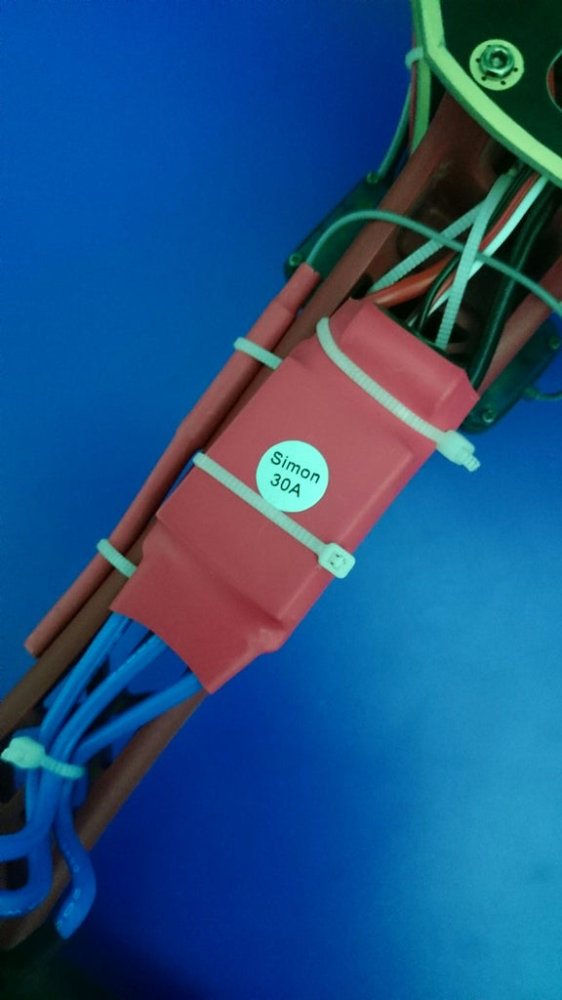

for propeller use the below diagram as refference (RW - clockwise propeller):

now come the fixing of FC(flight controller - APM board) place the board in center space as show below :

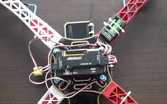
 
finally follow the below pattern to join the APM board , connect the the escs to apm ouput pins from 1 - 4 as the numbers below :

### now connect the apm input pins  from 1 - 6 (or 5) to reciever in sequence as follows:

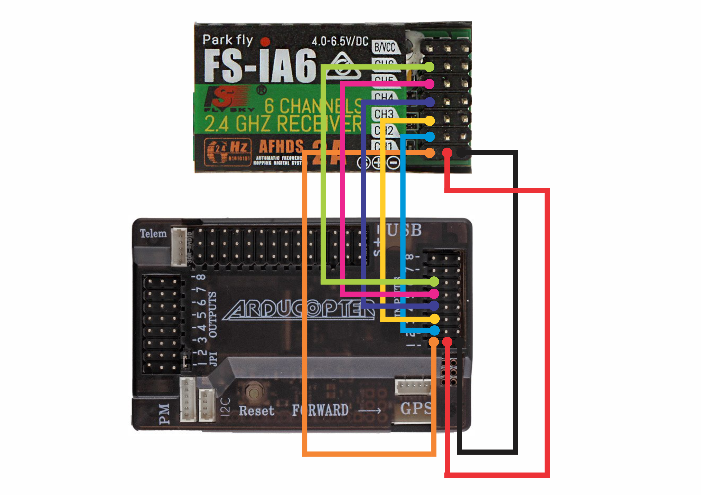

all set to fly ! 
 
#  INSTALL THE MISSION PLANNER or APM PLANNER for the 

use this link to callibrate the APM board :

https://www.instructables.com/id/APM-Quadcopter-Setup/

