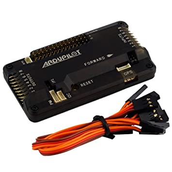

# DRONE_Ardupilot-APM-
DIY for Drone 

## Requirements :

Frame:
 

* F450 

Flight Controller (FC):

  

* Ardupilot/Arducopter(Clone of APM) 

RC Transmitter and Receiver:

  

* FlySky FS-i6 2.4G 6CH PPM  With FS-iA6B Receiver

ESCs :

  

* Four ESCs of 30 Amp ( SimonK)

Motors :
  
* Four 1000kv motors 
Propellers:
 
 
* 10X4.5 Inch 1045 / R CW CCW Propeller
Battery :

* range from 2500mah - 5000mah Lithium ion / LiPo (3s,4s,6s andy type )

Connectors :

* Jumper cable ( set of 60)

**optional**

Gps module :

  

* Ublox GPS M8N

